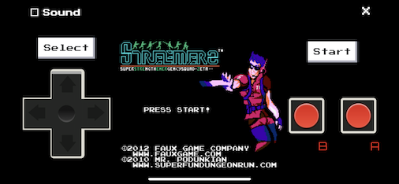

# PWA NES

An 8-bit Nintendo emulator Progressive Web App (PWA).

This App builts on top of these wonderful projects:
- [JSNES](https://github.com/bfirsh/jsnes/)
- [NES.css](https://nostalgic-css.github.io/NES.css/)
- [NES Controller CSS](https://codepen.io/injectilo/pen/MYJrmm)

If you like PWA NES please hit the star button :)

* [Installation](#installation)
* [Feedback, suggestions and bug reports](#feedback-suggestions-and-bug-reports)
* [Contributing](#contributing)
* [License](#license)

# Installation

If you're on iOS: in Safari tap the Share button in the browser and select "Add to Home Screen".

If you're on Android tap the ⋮ button next to the address field and select "Add to Home screen"
in the list of options that appears.

# Feedback, suggestions and bug reports

Please create an issue here: https://github.com/robvanderleek/pwa-nes/issues

# Contributing

If you have suggestions for how PWA NES could be improved, or want to report a bug, open an issue!
All and any contributions are welcome!

For more, check out the [Contributing Guide](docs/CONTRIBUTING.md).

# License

[ISC](LICENSE) © 2021 Rob van der Leek <robvanderleek@gmail.com> (https://twitter.com/robvanderleek)
